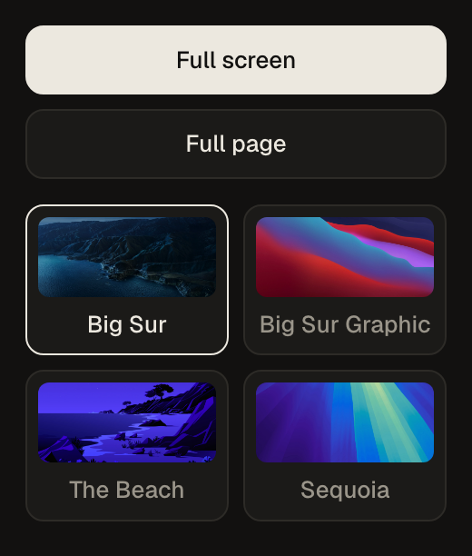

<p align="center">
  
</p>

<h1 align="center">Screenshot</h1>

<p align="center">Capture the visible area or the whole page, and frame it on a macOS dynamic wallpaper that follows your local time.</p>

<p align="center">
  
</p>

## Install (unpacked)

1. Open `chrome://extensions`
2. Turn on **Developer mode** (top right)
3. **Load unpacked** → pick this folder
4. Pin the extension so it's one click away

Then open any page, click the icon and pick **Full screen** or **Full page**. Chrome asks
where to save the PNG.

## How it behaves

- **Full screen** — exactly what's on screen, at your display's pixel density.
- **Full page** — scrolls the page one screen at a time and stitches the slices into one
  tall image. Works on app layouts too: if the document itself doesn't scroll, it finds the
  largest scrolling panel and captures that, keeping the UI around it in place.
- **Sticky and fixed bits** — sticky headers stop following the scroll, and fixed overlays
  (chat bubbles, cookie bars) show up once at the top instead of on every slice. Everything
  is put back exactly as it was afterwards, scroll position included.
- **Backgrounds** — *Big Sur*, *Big Sur Graphic*, *The Beach*, *Sequoia*, *Mountain Lake* and
  *Sunflowers* centre the shot
  with rounded corners and a soft two-layer shadow on a 16:10 crop of the wallpaper. Tap to
  toggle: pick one to always use it, several to shuffle between them, or none to save the
  raw capture. Your picks are remembered.
- **Time of day** — like the macOS dynamic wallpapers, the background follows your clock.
  Big Sur and The Beach step through eight frames (night, dawn, sunrise, morning, midday,
  afternoon, sunset, dusk); Big Sur Graphic and Sequoia switch between light (7:00–18:59)
  and dark. macOS uses the sun's real position for your location; here the hours are fixed,
  so sunrise is always around 6:00 and sunset around 17:00. Mountain Lake and Sunflowers are
  single still images and look the same all day.

## Limits

- Chrome allows two visible-tab captures per second, so a full-page shot takes about half a
  second per screen.
- Very tall pages cap out around 32,000 px (the canvas limit).
- Fixed or sticky elements inside shadow DOM aren't caught.
- Chrome pages (`chrome://`, the Web Store) can't be captured by any extension.

## Layout

```
manifest.json          MV3 manifest — permissions, icons, popup, worker
background.js          service worker: capture, full-page stitching, backgrounds
popup.html             toolbar popup: the two capture buttons and background toggles
popup.js               hour → wallpaper frame table, remembers picks, sends the capture request
backgrounds/           <name>-<frame>.webp, frames extracted from the macOS wallpapers (plus two generated stills)
icons/                 icon.svg source + rendered PNGs
screenshots/           the images in this README
```

Full-page capture uses `captureVisibleTab` slices rather than the DevTools protocol:
Chrome only paints what's in the viewport, so a single CDP capture of a long page repeats
the first screen. Stitching happens on an `OffscreenCanvas` in the worker, so nothing is
injected into the page beyond the scroll and style tweaks, which are undone when it's done.
